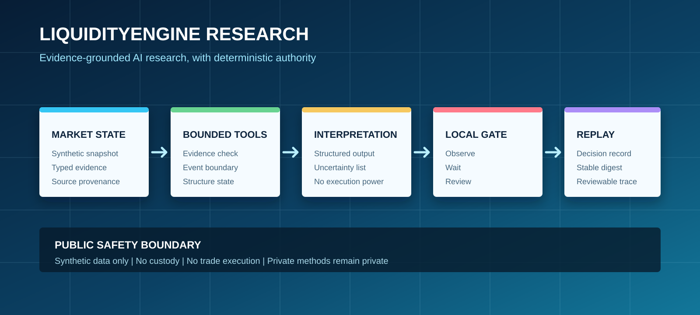
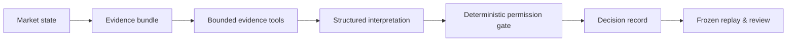

# LiquidityEngine Research

**An open reference implementation for auditable AI research workflows in crypto derivatives.**

[](https://github.com/Chengnanyaowang/LiquidityEngine-Research/actions/workflows/ci.yml)



LiquidityEngine Research is the public technical companion to LiquidityEngine, an AI-native operating layer for professional crypto-derivatives research. It demonstrates how a market observation can become a reviewable agent run without turning an LLM into an unbounded trading authority.

> **This repository is a research sandbox, not a trading bot, investment product, or signal service.** It contains synthetic examples and public interfaces only. Production strategy logic, live infrastructure, credentials, customer data, and proprietary research methods remain private.

## The problem

Crypto trading teams can see charts, liquidation data, open interest, and news, but their decisions are often scattered across terminals, scripts, chat messages, and memory. That makes it difficult to answer four operational questions:

1. What market evidence was available at the time of a decision?
2. What did the AI interpret, and what was still missing?
3. Which deterministic controls allowed, deferred, or blocked the action?
4. Can the team replay the decision later without changing the historical record?

## One research loop



The public agent uses a deterministic offline interpreter so every example is safe and reproducible. A production model may summarize context behind the same interface, but the local permission gate remains explicit, inspectable, and authoritative. The gate only returns research states such as `observe`, `wait`, or `review`; it never emits executable trade instructions.

## What is included

- A dependency-light Python package for market snapshots, evidence bundles, decision records, and deterministic replay.
- A bounded `ResearchAgent` that records tool use, structured interpretation, local authorization, and a complete run trace.
- Four synthetic scenarios covering resolved observation, unresolved structure, event risk, and missing evidence.
- A deliberately conservative permission gate for missing-evidence and event-risk handling.
- Twelve tests that lock agent boundaries, schema behavior, and replay determinism.
- Architecture, redaction, evaluation, competition, and roadmap documentation.

## What is intentionally not included

- Proprietary market-structure definitions, thresholds, scoring, prompts, or strategy authority files.
- Live exchange connectors, API keys, WebSocket sessions, and execution logic.
- Real trading records, customer data, account information, or unreleased benchmarks.
- Any automated instruction to buy, sell, open, close, or size a position.

## Quick start

Requires Python 3.10+.

```bash
git clone https://github.com/Chengnanyaowang/LiquidityEngine-Research.git
cd LiquidityEngine-Research
python -m venv .venv
```

Windows PowerShell:

```powershell
.\.venv\Scripts\Activate.ps1
pip install -e .[dev]
python scripts\run_demo.py
python scripts\run_agent_demo.py --scenario all
pytest -q
```

macOS / Linux:

```bash
source .venv/bin/activate
pip install -e '.[dev]'
python scripts/run_demo.py
python scripts/run_agent_demo.py --scenario all
pytest -q
```

## Public repository map

```text
src/liquidityengine_research/   Agent, data contracts, policy gate, and replay engine
examples/                       Synthetic fixtures and bounded scenarios only
scripts/                        Runnable replay and agent demonstrations
tests/                          Agent, determinism, and safety-boundary tests
docs/                           Architecture, contracts, evaluation, and safety policy
assets/                         Approved public architecture media
.github/workflows/              Automated Python 3.10 and 3.12 checks
```

## Product principles

| Principle | In practice |
| --- | --- |
| Evidence before narrative | Every run references fixed evidence and provenance. |
| AI is bounded | Interpretation is separated from deterministic authorization. |
| No silent revision | Historical records are replayed against their original inputs. |
| Research, not custody | No custody, execution, advisory, or asset-management service. |
| Private methods stay private | Public contracts and safety patterns do not expose proprietary strategy. |

## Documentation

- [Architecture](docs/architecture.md)
- [Decision record contract](docs/decision-record-contract.md)
- [Evaluation methodology](docs/evaluation.md)
- [Security and redaction policy](docs/security-and-redaction.md)
- [Product roadmap](docs/roadmap.md)
- [GOAI competition overview](docs/goai-submission.md)
- [Team](TEAM.md)
- [Chinese overview](README.zh-CN.md)

## For investors, research teams, and design partners

This repository makes the product's engineering thesis inspectable without exposing commercial IP. The broader LiquidityEngine product is developed privately around professional BTC-perpetual research workflows, observable decision states, and replayable research traces.

- Product walkthrough: [LiquidityEngine demo](https://youtu.be/Jy_4ANm5ClY)
- Contact: **pacinocorleone143@gmail.com**

## Disclaimer

Nothing in this repository is investment advice, a recommendation, an offer, or a solicitation to transact in any asset. Synthetic examples must not be used to operate a trading system. See [SECURITY.md](SECURITY.md) and [docs/security-and-redaction.md](docs/security-and-redaction.md).

## License

The public reference implementation is licensed under [Apache-2.0](LICENSE). The LiquidityEngine name, production system, proprietary strategy research, and private operational materials are not licensed by this repository.
