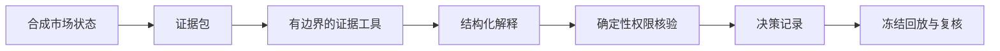

# LiquidityEngine Research

**面向加密衍生品研究的可审计 AI Agent 工作流公开参考实现。**

[](https://github.com/Chengnanyaowang/LiquidityEngine-Research/actions/workflows/ci.yml)


LiquidityEngine Research 是 LiquidityEngine 的公开技术配套仓库。它展示如何把一份市场状态转换为有证据来源、有工具轨迹、有本地权限核验、可以重复回放的研究记录。

> **本仓库不是交易机器人、投资产品或喊单服务。** 所有行情和判断均为合成示例；真实策略、阈值、模型提示词、客户数据、账户信息和生产基础设施保持私有。

## 要解决的问题

专业数字资产研究团队通常同时使用行情终端、持仓和清算数据、新闻、脚本与聊天工具。判断过程分散后，很难回答：

1. 当时有哪些市场事实？
2. AI 使用了哪些证据和工具？
3. 哪一层规则允许、等待或阻止了研究状态？
4. 事后能否使用原始证据重放，而不是让新模型改写历史？

## 一条完整研究链路



公开版本使用离线合成解释器，保证演示可复现且不消耗 API。生产模型可以在同一个接口后提供语义解释，但不能绕过本地权限层。

## 当前公开能力

- `ResearchAgent`：编排证据检查、解释、权限核验和记录生成。
- `EvidenceToolbox`：记录证据完整性、事件边界和结构状态检查。
- `SyntheticResearchInterpreter`：输出非执行型结构化研究解释。
- `PermissionGate`：只允许 `observe / wait / review` 三种研究状态。
- `ReplayEngine`：固定输入得到固定摘要和决策记录。
- 四组安全合成场景：结构已解析、结构未解析、事件风险、证据缺失。
- Python 3.10 与 3.12 自动化检查。

## 快速运行

需要 Python 3.10 或更高版本。

```powershell
git clone https://github.com/Chengnanyaowang/LiquidityEngine-Research.git
cd LiquidityEngine-Research
python -m venv .venv
.\.venv\Scripts\Activate.ps1
pip install -e .[dev]
python scripts\run_agent_demo.py --scenario all
pytest -q
```

预期会看到四种研究状态，不会看到买入、卖出、仓位、止损或执行指令。

## 公开与私有边界

公开内容：

- 合成数据契约与 Agent 编排接口；
- 通用权限核验和确定性回放；
- 安全测试、架构和评估方法。

不公开内容：

- 生产策略理论、阈值、评分权重和提示词；
- 实时交易所连接、账户、密钥和客户数据；
- 真实交易记录、持仓、收益或未公开 benchmark；
- 自动开仓、平仓和仓位执行逻辑。

## 项目结构

```text
src/liquidityengine_research/   Agent、数据契约、权限门和回放引擎
examples/                       仅包含合成场景
scripts/                        可直接运行的公开演示
tests/                          Agent 与安全边界测试
docs/                           架构、评估、GOAI 和安全说明
assets/                         审核后的公开素材
.github/workflows/              自动化测试
```

## 团队与演示

项目由 Zhang Qingyu 和 Li Runpeng 共同开发，分工见 [TEAM.md](TEAM.md)。

- 产品演示：[YouTube](https://youtu.be/Jy_4ANm5ClY)
- GOAI 说明：[docs/goai-submission.md](docs/goai-submission.md)
- 联系邮箱：**pacinocorleone143@gmail.com**

## 免责声明

本仓库不构成投资建议、交易推荐、要约或招揽。合成示例不得用于运行真实交易系统。公开代码采用 [Apache-2.0](LICENSE)；LiquidityEngine 名称、生产系统和私有研究方法不在本仓库授权范围内。
