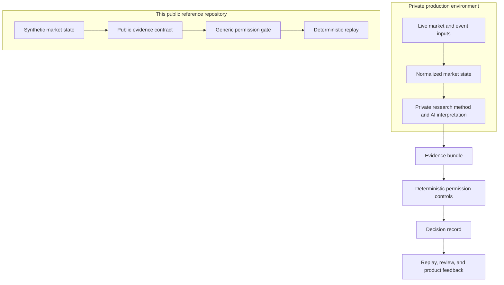

# Architecture

## Product boundary

LiquidityEngine is designed as a research operating layer, not a black-box signal feed. The production system is private. This repository makes the architectural boundary inspectable through stable data contracts and a synthetic deterministic replay.

## Key abstractions

| Contract | Purpose | Public status |
| --- | --- | --- |
| `MarketSnapshot` | Normalizes a time-stamped market observation. | Included with synthetic data only. |
| `EvidenceItem` | Gives each input fact a category and provenance. | Included. |
| `PermissionGate` | Applies transparent research safety checks. | Included as a generic example. |
| `DecisionRecord` | Stores action, reasons, evidence IDs, and a fact digest. | Included. |
| Production strategy authority | Determines how a private research method interprets market structure. | Private. |

## Why the split matters

An AI-generated explanation is useful only when a team can distinguish it from authorization. In the LiquidityEngine design, an interpretation can describe uncertainty, but a deterministic layer records whether the evidence is complete, whether a high-level event boundary requires review, and whether the resulting state may proceed in the research workflow.

The public implementation deliberately stops there. It demonstrates reproducible decision infrastructure without publishing a strategy or execution path.
